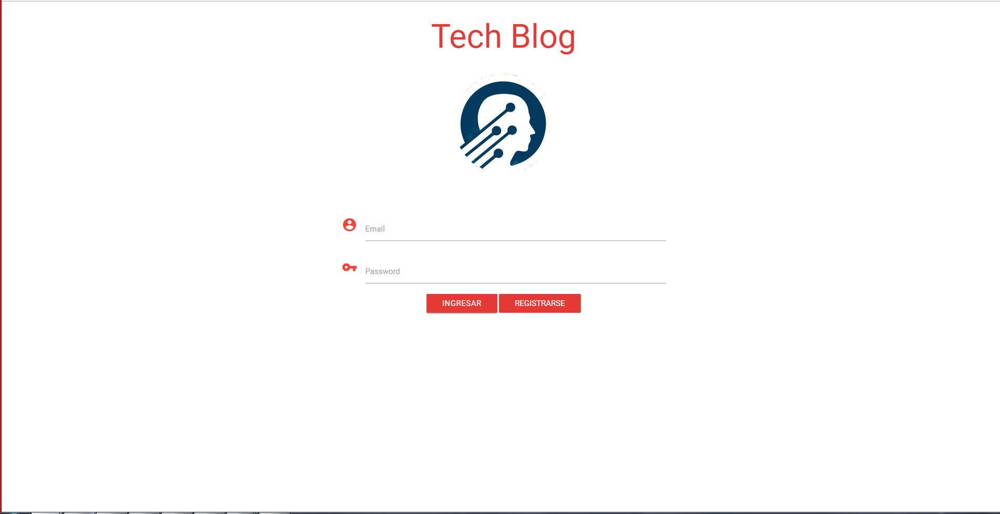
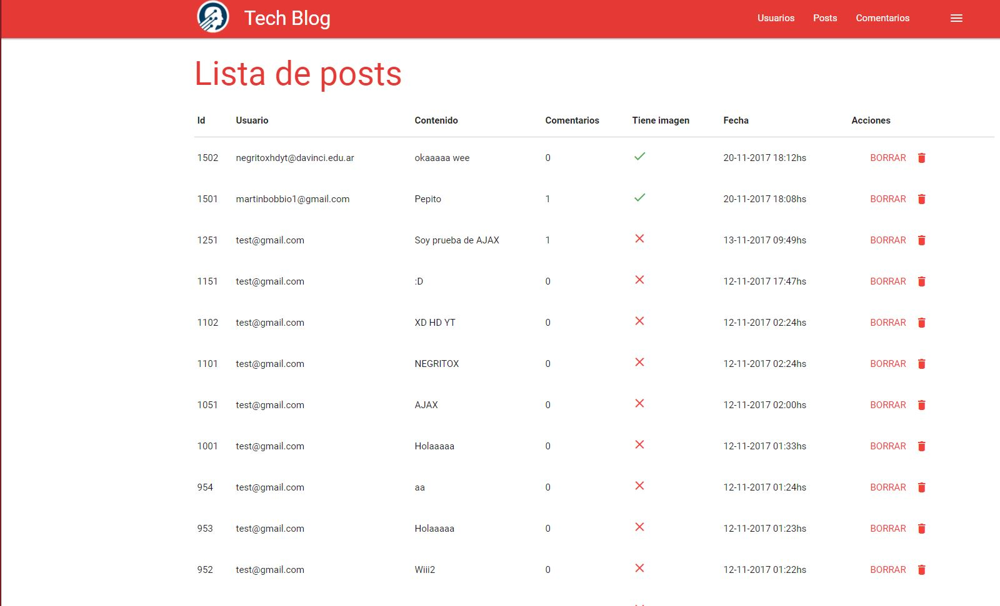
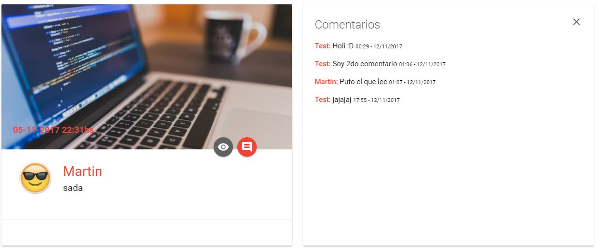
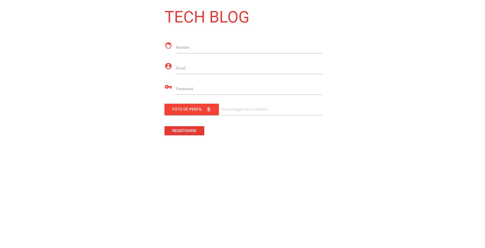
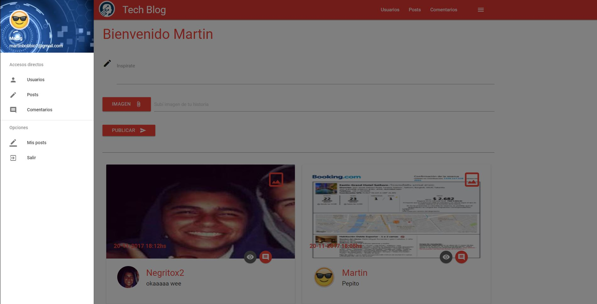

## Tech Blog

**Descripcion:**
Trabajo práctico del sexto cuatrimestre de la Escuela DaVinci desarrollado con *Maven*, *JSF* y un maquetado con *Materialize*.
La pagina ofrece un sistema de *login*, *registro* y la posibilidad que los usuarios suban posts y puedan ver los que subieron.
Todo esto se realiza mediante conexiones a una Base de datos *SQL* y con el modelo de la misma generada por *Entities*.

**Tecnologias usadas:**
Maven, Tomee, Materialize y Java

Inicio:

Lista de Posts:

Comentarios:

Vista de Registro:

Menu de Perfil:

**¿Como utilizo este proyecto?**
Para que el proyecto se conecte con *Maven* y haga la conexion con la Base de datos es necesario seguir los siguientes pasos:
1) En la consola del Sistema (CMD en Windows) ubicarse en la ruta del proyecto.
2) Ingresar el siguiente comando Maven: 
  *mvn clean package tomee:run*
3) Una vez finalizada la carga ingresar en el navegador web debes ingresar en la URL:
  *localhost:8080/index.xhtml*
  Esto te redireccionara al index de la WEB.

**Uso de la base de datos**
En SQL ingresar lo siguiente:

CREATE DATABASE blog_maven;
GRANT USAGE ON *.* TO mbobbio@localhost IDENTIFIED BY '1234';
GRANT ALL PRIVILEGES ON blog_maven.* TO mbobbio@localhost;
USE blog_maven;
